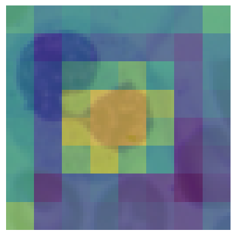
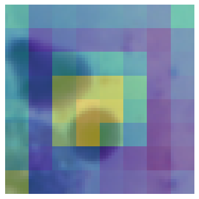
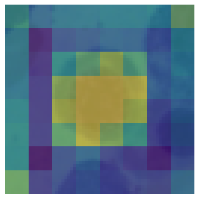
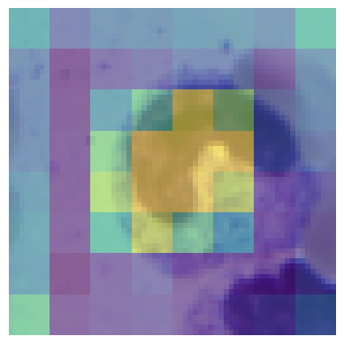

# MM dynamics evolved: explainable multimodal classification

This repository investigates the MM dynamics
approach proposed by [Han et al. (2022)](https://ieeexplore.ieee.org/document/9878603) 
multi-modal fusion in biomedical classification
tasks. The MM dynamics algorithm integrates
feature-level and modality-level informativeness
to dynamically fuse modalities for improved
classification performance. For more information, visit the [mmdynamics git repository](https://github.com/TencentAILabHealthcare/mmdynamics). However, our analysis
reveals several limitations and challenges in
replicating and extending the results of MM
dynamics. The study found that feature informa-
tiveness improves performance and explainability,
while modality informativeness does not provide
significant advantages and can lead to performance
degradation. Based on these results, we have
extended feature informativeness to image data,
resulting in the development of Image MM
dynamics. Although this approach showed
promising qualitative results, it did not outperform
baseline methods quantitatively.

  
  
  
  

## Data
The dataset created by  Burkhardt et al. (2022) consists of multi-omics data such as gene expression profiles (RNA) and protein levels (protein) of single cells from mobilised peripheral CD34+ haematopoietic stem and progenitor cells isolated from three different healthy human donors. These cells are vital to the hematopoietic system and can differentiate in the bone marrow into different blood cells. Each cell is annotated with its corresponding cell type which cover B-lymphocytes progenitor, neutrophil progenitor, monocyte progenitor, and erythrocyte progenitor.

In addition, an independent image dataset was selected, comprising single-cell images from bone marrow (Matek et al., 2021). The data set can be downloaded using this [link](https://wiki.cancerimagingarchive.net/pages/viewpage.action?pageId=101941770). From this dataset, images corresponding to the four classes — lymphocytes, neutrophilic granulocytes, monocytes, and erythroblasts — were respectively chosen and are illustrated in Figure \ref{fig:dataset_images}. Each multi-omics data point is associated with an image depicting the same cell type. It is worth noting that the images presented may not necessarily depict the exact cells from which the omics data was extracted.  Nevertheless, this disparity does not present any significant obstacle, given that the primary objective is to classify cell types rather than to match individual cells across various modalities. 

## Image MM Dynamics 
MM dynamics was originally designed to analyze only tabular genetic data. However, we were able to extend its applicability to image data with some adjustments to two key components of the algorithm. Firstly, we needed to refine how feature informativeness is computed due to the shift in informativeness from individual pixels to groups of neighbouring pixels. It is not meaningful to determine the relevance of individual pixels, as is the case with individual genes. Instead, we grouped neighbouring pixels into patches and determined their significance, which is a more sensible approach. Secondly, we needed to adapt the uni-modal encoder to process image data, which is different from tabular genetic data. The original encoder was not suitable for this purpose.

For the feature informativeness encoder, we chose a compact U-net architecture known for its effectiveness in biomedical segmentation tasks (Ronneberger et al., 2015). The structure of this model is an encoder-decoder with skip connections between corresponding layers of the encoder and decoder. The encoder uses convolutional and pooling layers to downsample the input image and extract features, while the decoder upsamples the feature maps to produce a segmentation map. The skip connections aid in preserving spatial information and mitigating the vanishing gradient problem during training. 
In our implementation, we used a two-step downsampling process, achieved through convolution and pooling operations. This reduced the input size by a factor of 4 at each step. After each downsampling step, we applied Rectified Linear Unit (ReLU) activation functions to the feature maps.
In contrast, for the decoder, we chose to use a single upsampling convolution operation, omitting the final upsampling convolution and instead using nearest-neighbour interpolation. This method produces a feature informativeness heat-map with patches that are 4x4 pixels in size, ensuring that equal informativeness is given to entire regions rather than individual pixels.
 
For the uni-modal encoder, we use a CNN architecture consisting of two convolutional layers, integrated max-pooling, and two fully connected layers with ReLU activation. This decision was made to create a compact network for proof of concept.

## Results

## Image dynamics

| Method        | Modalities   | F1 Score          | F1 macro          | Recall            | Precision         | Accuracy          | Balanced accuracy |
|---------------|--------------|-------------------|-------------------|-------------------|-------------------|-------------------|-------------------|
| CNN           | I            | 87.00 ± 1.7       | 63.00 ± 2.1       | 85.20 ± 1.4       | 89.75 ± 1.5       | 85.20 ± 1.5       | 73.03 ± 1.7       |
| MM dynamics   | R + I        | 95.54 ± 1.3       | 74.35 ± 3.4       | 96.12 ± 1.2       | 95.82 ± 1.4       | 96.12 ± 1.2       | 70.07 ± 2.5       |
| MM dynamics   | P + I        | 83.55 ± 0.8       | 60.36 ± 5.7       | 81.14 ± 2.2       | 87.48 ± 1.4       | 81.14 ± 2.2       | 71.67 ± 2.7       |
| MM static     | P + R + I    | **96.74 ± 0.7**   | **81.01 ± 2.3**   | **97.03 ± 0.6**   | **96.84 ± 0.6**   | **97.03 ± 0.6**   | **76.97 ± 0.4**   |
| MM dynamics   | P + R + I    | 95.98 ± 1.7       | 78.64 ± 2.1       | 96.50 ± 1.4       | 96.41 ± 1.4       | 96.50 ± 1.7       | 73.50 ± 1.7       |

Overview of the results obtained using new Image MM dynamics extension. For comparison, MM static was also calculated as a baseline on all three modalities, along with ablations using Image MM dynamics only on image and another modality, as well as solely image for comparison.  The results show that while Image MM dynamics cannot match MM static and the latter remains superior, there is a significant improvement compared to using only two modalities. However, the use of three modalities resulted in a significant improvement compared to using only two, indicating the effectiveness of integrating images into the original MM dynamics algorithm. The abbreviations used are R for RNA, P for protein, and I for images with latent representation dimensions of 250, 35 and 500, respectively.

| Method        | Modalities  | F1 Score          | F1 macro          | Recall            | Precision         | Accuracy          | Balanced accuracy |
|---------------|-------------|-------------------|-------------------|-------------------|-------------------|-------------------|-------------------|
| MM dynamics   | P + R + I* | 92.97 ± 3.8       | 64.69 ± 4.8       | 94.19 ± 3.1       | 93.78 ± 2.3       | 94.19 ± 3.1       | 61.58 ± 4.8       |
| MM dynamics   | P + R       | 94.32 ± 1.7       | 66.67 ± 2.7       | 95.13 ± 1.5       | 93.90 ± 1.7       | 95.13 ± 1.5       | 64.53 ± 2.6       |
| MM static     | P + R + I* | 93.82 ± 2.9       | 70.65 ± 4.9       | 94.43 ± 2.6       | 94.17 ± 2.5       | 94.43 ± 2.6       | 66.54 ± 4.9       |

Overview of the results obtained using new image MM dynamics approaches when masking the image modality. The images were masked only during testing by substituting them with gray images of uniform intensity 0.5. Additionally, MM static was included as a baseline for comparison. The results indicate that MM dynamics performs noticeably worse than the static late fusion baseline or dynamic late fusion trained solely on the available modalities. The abbreviations used are R for RNA, P for protein, and I* for masked images with latent representation dimensions of 250, 35 and 500, respectively.

### Reproduction of MM dynamics
| Method        | Fusion strategy | F1 Score           | F1 macro         | Recall            | Precision         | Accuracy          | Balanced accuracy |
|---------------|-----------------|--------------------|------------------|-------------------|-------------------|-------------------|-------------------|
| KNN           | early           | 94.64 ± 1.8        | 72.57 ± 6.7      | 95.36 ± 1.4       | 95.43 ± 1.4       | 95.36 ± 1.4       | 68.06 ± 6.5       |
| LR            | early           | **96.13 ± 1.1**    | **77.23 ± 2.4**  | **96.51 ± 0.9**   | **96.29 ± 1.1**   | **96.51 ± 0.9**   | **73.60 ± 4.1**   |
| NN            | early           | 95.73 ± 1.3        | 74.58 ± 2.9      | 96.22 ± 1.1       | 95.98 ± 1.3       | 96.22 ± 1.1       | 71.44 ± 4.3       |
| RF            | early           | 94.84 ± 2.0        | 66.02 ± 3.2      | 95.89 ± 1.6       | 94.63 ± 1.4       | 95.89 ± 1.6       | 63.72 ± 3.7       |
| SVM           | early           | 95.62 ± 1.9        | 72.42 ± 5.6      | 96.32 ± 1.5       | 96.34 ± 1.5       | **96.32 ± 1.5**   | 68.79 ± 5.9       |
| HEALNet       | intermediate    | 95.84 ± 1.2        | 76.76 ± 1.6      | 96.22 ± 1.1       | 95.91 ± 1.2       | 96.22 ± 1.1       | **73.58 ± 0.8**   |
| MCAT          | late            | 95.55 ± 1.3        | 72.66 ± 1.6      | 95.99 ± 1.2       | 95.46 ± 1.2       | 95.99 ± 1.2       | 70.46 ± 0.8       |
| MM static     | late            | 94.99 ± 0.7        | 71.04 ± 1.2      | 95.53 ± 0.6       | 94.89 ± 0.8       | 95.52 ± 0.6       | 69.12 ± 2.1       |
| MM dynamics   | late            | 94.32 ± 1.7        | 66.67 ± 2.7      | 95.13 ± 1.5       | 93.90 ± 1.7       | 95.13 ± 1.5       | 64.53 ± 2.6       |

Comparison of state-of-the-art methods using the modalities RNA and protein.  The best results per column are in bold. The analysis reveals that basic machine learning classifiers exhibit the highest performance, particularly logistic regression (LR). Among deep learning models, only HEALNet achieves partially comparable results.

 Overview of ablation studies that examine the impact of feature informativeness (FI) and modality informativeness (MI) components in the MM dynamics approach. FI refers to the inclusion of feature informativeness, MI refers to the inclusion of modality informativeness, and 'Both' indicates the incorporation of both FI and MI components. 'None' denotes scenarios where neither FI nor MI components are utilised. The figure displays the results across various evaluation metrics. All results were generated using MM dynamics trained on RNA and protein with latent representation dimensions of 250 and 35, respectively.
